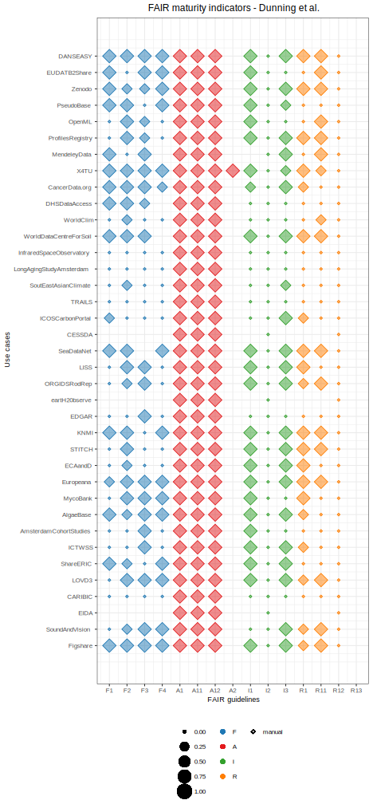

## Discussion {.page_break_before}

**Heavily work in progress**

In this study, we proposed an approach to calculated FAIR maturity indicators in the life science.
We tested our method on two real use cases from our Department.
We created a reproducible pipeline using Jupter notebook.

<!--**Criteria and discussion of results** -->
Our implementation builds on the shoulders of the implementations by the Maturity Indicator Authoring Group [], Dunning et al. [], and Weber et al [].
Specifically:

- *Findable*
For F1 we all agree that there has to be a DOI, and similarty for F3
F2 is the metric that allows for the largest interpretation that goes from structure data, metrics of time and compliance
F3 is fine for everybody
F4 different searchable resources

- *Accessible*
We retrieved our data using the HTTP protocol, which is free, open and allows for authentication.
However, differently from what specified by the guideline, we did not retrieve data and metadata by their identifiers, but by the search keywords researchers used when manually querying the repository because the repository we investigated do not provide globally unique and persistent identifiers.
Both dataset top scored in the A1 and sub-principles, however NBIA_GEO did not have an automatically retrievable policy from re3data (which does not imply that the policy is automatically or manually retrievable somewhere.
If data is on a local excel file or database, then we need a different implementation

- *Interoperable*
I1: Similarly to Wilkinson et al, we passed metadata structured in a formal file format, such as xml. However Dunning et al and Weber et al. suggest using a more strict criteria such  as that metadata have to have a standardized schema, such as [Dublin Core](https://www.dublincore.org/) or [DataCite](https://schema.datacite.org/).
Similarly to dunning and weber, we did not evaluate FAIRness of vocabulary as it is not clear to us...
Finally, we manually looked for reference to other dataset identifiers in the metadata
Both use cases scored the same way because they both had structured metadata (e.g. not a plain text) and did contain references to other datasets

- *Reusable*
The Maturity Indicator Authoring group does not provide any guideline, weber uses the same metadata as F2. We followed the separation by dunning of dividing findable from reusable keywords. However, we calculated that just as a difference between the total amount of metadata and the search keywords
The license presence is pretty straight-forward, there is accordance among Studies
Wherease for provenance we propose specifically authors email and title of publication
Finally, non of the work in the literature nor the guidelines have evaluated community standards, most likely because they do not exist
Our use cases  scored similarly well for the two first maturity indicators as they both had a large number of metadata and a license retrievable in re3data, however the case NBIA_GEO did not have authors in the metadata

The largest similarities among studies to calculate maturity indicators are for more precise guidelines, such as F1,
whereas the a range of different implementations are for the F2, I1
Comparison with other papers - create graph for dunning?
- Comments on the findings  

<!--*Practical implementation*-->

We assessed FAIR maturity indicators using a mixed manual and automatic approach.
In the literature, Dunning at al. used a fully manual approach, although the guidelines recommend an automatic one.
On the other side, Weber et al. used a fully automatic approach, but they could calculate only 10 out of 15 metrics.
A mixed approach allowed us to assess automatically the metrics that were easily retrievable, and to complement manually with the ones that were not retrievable via API, hoping that in the future it will be possible to retrieve them automatically
Both our manual and automatic implementations required knowledge of data schema.
Specifically, we had to know in advance some keywords, such as "author", "email"
Similarly, we had to know the fields in re3data, such as "data availability policy" for A2 "datalicensename" and "datalicenseurl" for R1.1
In addition, we had to implement a manual change
For example, when assessing criteria F2 (keywords are in metadata), we had to change the keyword "true" that we used for data retrieval into "rawdata"
This is different from what Wilkinsons et al propose with the new FAIR maturity indicators, where the approach is fully automatic.
However, their workflow start with a  globally unique identifier (GUID). However, when researchers look for data they do not know already the identifiers, they do not simulate what researchers do. In addition, this workflow would preclude the analysis of our two repositories as they do not provide GUIDs (F1).  

Metadata format chosen could be [DataCite](https://schema.datacite.org/), which provides a standard for metadata for publication and citation of research data, or [schema.org](www.schema.org), which provide more generic schemas for structured data on the Internet. Both are community-based initiative aiming at

We extracted information about the repositories from re3data. These information were about DOI, availability policy of metadata when data are not available, and data license.
We selected only one registry (re3data) and one search engine(Google Dataset search). In the first case, alternative can be FAIRshare, however it still does not provide an open API. on the other side, we could have choose a generic search engine, like google, but we considered pertinent to look for a dataset specifically in a dataset search engine.
We chose re3data as it provides an API for queries. Other registries, such as FAIRshare, do not provide open API yet.
Similarly, Google Dataset Search does not provide any API, so we did a manual search.

Similarly to Dunning et al. and to Weber et al. we did not computer two principles. The first isthe principle I2. i.e. presence of a fair metadata vocabulary. The difficulty raises from the fact that
The second is R13, which is that metadata follow community standards at those have not been formally established yet.

comparison with dunning: mainly the criteria expecially difference between metadata for findable and reusable.
comparison with Weber: re3data,
comparison with Wilkinson: assumes that the GUID is already know thus skipping the finding of the dataset - this is not compatible with our findable criteria

Before calculating the metrics we decided to simulate dataset retrieval via API. We assumed that a researcher does not know a priori the. Sometimes you dont get only 1 datasets

<!--**Reproducibility**-->
- We chose python as it is a language that is used in various scientific communities and thus could potentially provide extension and reuse of our work.
- We chose to use Jupyter notebooks for reproducibility of our results. However, databases change but they do not provide versions. Therefore, we can just declare the time stamps when our query was done. In addition, Jupyter notebooks are both machine and human readable, and easier to export to other domains that do not use specifically programming languages designed for the web  
To be fully reproducible, ideally repositories and registries should have a version of their database or provide a doi of metadata

<!--**Visualizing the FAIR maturity indicators**-->
To summarize and compare the FAIRness 
 evaluation we used a visualization that embeds principles, scores, and type of information retrieval (manual, automatic, not assessed).

We created a visualization plot to summarize FAIR evaluation and compare results of various datasets.

 and implementations.
We chose not to create a final score in accordance (to uniform) with the recommendations for the FAIR guidelines that want to keep suggestions and not to assign a score.
The summary of metrics is provided by the fact the we exploited shapes, colors, and sizes to put all possible information.
On the other side, the fact that each row represent a dataset allows for comparison among datasets

A visual approach
Visualizing results for summary and comparison is an approach taken also by FAIRshake.
They created *insignas*,
which FAIRness using a color gradient from blue (satisfactory) to red (unsatisfactory).
The platform FAIRshake provide visualizations that can dinamically expand to fit scores calculated using different metrics.

Differently, we chose a static approach because these the FAIRshake insignias do not allow for comparison
has implemented visualizations called "insignas", where they use color gradents

- We chose to plot our results instead of providing a final score to avoid negative connotations (see FAIR metrics vs. maturity indicators).
  However, we wanted to be able to compare our results, so we used balloon plots, usually used for categorical data visualization and comparison. (FAIR shake uses visualizations too but they are not comparable)  
- NO final score because

{#fig:dunning width="100%"}

**Difficulty / Limitations**

Some limitations must be acknowledged.
First, our approach requires an a-priori knowledge of metadata structure.

Different repositories use different data structure.
Automatization occurs after a lot of manual investigation

- We had to adapt the code based on  API type and response schema.
  Our implementation requires specific knowledge of the database structure and thus it is difficult to directly generalize it to various databases  
- We considered use cases where all queries provided one final dataset. In real practice, researchers often need to compare subset of retrieved datasets manually because there are not enough information to discriminate them computationally (the information is present, but not machine-readable)  
Our implementation requires specific knowledge of the database structure and thus it is difficult to directly generalize it to various databases.  
Different repositories use different html tags to define their
- Database APIs do not allow to retrieve all the information that the user interface allows (example 1: ChEBI does not allow to retrieve information about reactions; example 2: Array Express has some metadata in tables that must be downloaded locally before being queried  

*Limitations of current implementation*
- Limitations: A1, A11, A12: retrieve information only via HTTP, so they are all true. If data is on a local excel file or database, then we need a different implementation
+ Retrieval is not via identifier but keywords
- Repositories not databases

*General considerations*
All the information needed are retrieved from metadata, not from data.
We did not investigate databases, but only repositories

In conclusion, we have proposed a computational implementation to calculate FAIR maturity indicators in the life sciences.
Similarities and differences with the other criteria
Conclusion:
- it would be great if all repos had similar schema
- it would be great if we could access everything via API

  <!--
  The interpretation of the FAIR principles was not always trivial. Given that they are vague by definition, we had to take decision. We based our decisions on the principles themselves,
  the interpretation by the authors of the metrics and two previous studies that computed FAIR maturity indicators on a large
  -->
